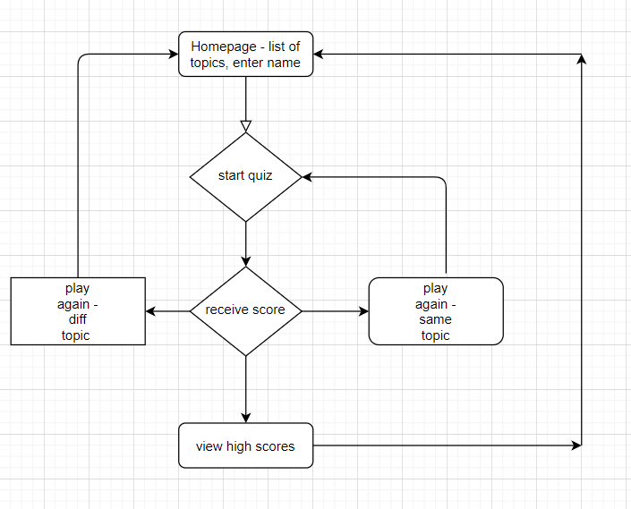

Project Title: Tricky Trivia

Team 7: 
Aimee Tollett
Benjamin Young
Muna Ahmed
Aiya Siddig

Project Description:
Our project idea is to create a trivia game. It will include several different topics and a high scores screen at the end. Our topics include: cultures around the world, current events/politics, sports and TV. 

User Story:
Who is your audience? Anyone looking for entertainment
What is the problem the product will address? Lack of entertainment
How does the product solve that problem? Allowing users to test their knowledge on a series of subjects

APIs: New York Times, OMDB

Wire Frame:

Breakdown of Tasks:
Aimee – Backend
Benjamin – Frontend
Muna – Backend
Aiya – Backend/Frontend
